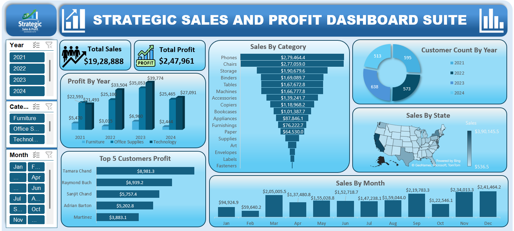

# Strategic Sales and Profit Dashboard Suite

## 📌 Project Overview
Interactive Sales and Profit Dashboard built in Excel during my *Data Analyst Internship at Cravita Technologies*. This project focuses on transforming raw business data into actionable insights for stakeholders.

## 🚀 Key Highlights & KPIs
* *Total Revenue:* Visualized *$1.92M in Gross Sales* across 4 years.
* *Profitability:* Tracked a *Net Profit of $247K* for bottom-line reporting.
* *Product Performance:* Identified *Phones ($279K)* as the top revenue driver.
* *Customer Value:* Pinpointed the *Top 5 most profitable customers* to assist strategy.
* *Interactivity:* Integrated dynamic *Year, Month, and Category slicers* for real-time filtering.

## 🛠️ Tools & Skills
* *Excel:* Pivot Tables, Pivot Charts, Slicers, and Data Modeling.
* *Data Science Coursework:* Applying analytical thinking and data cleaning principles.
* *UI/UX:* Designed a professional, stakeholder-ready dashboard layout.

## 👤 Contact
* *Author:* Pranav Kesarkar
* *LinkedIn:* [https://www.linkedin.com/in/pranav-kesarkar]
